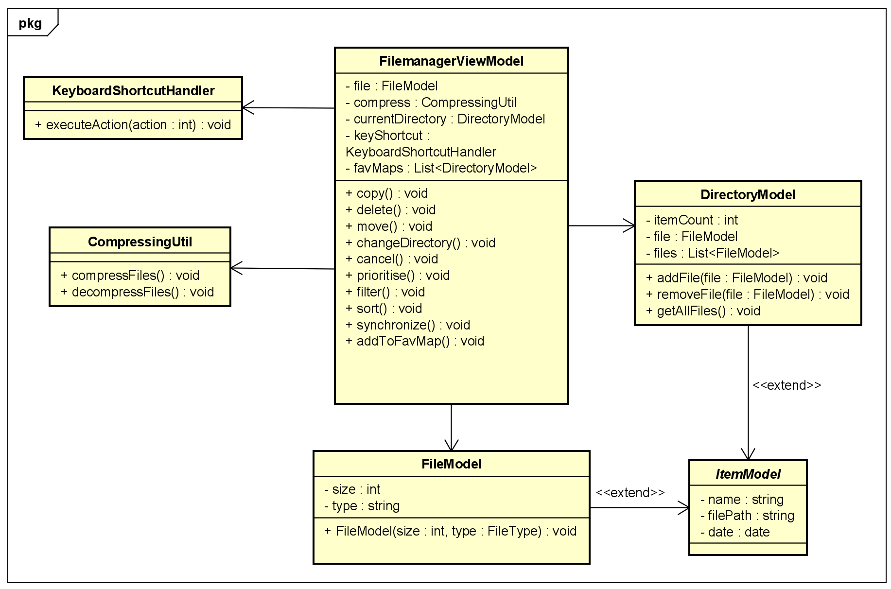
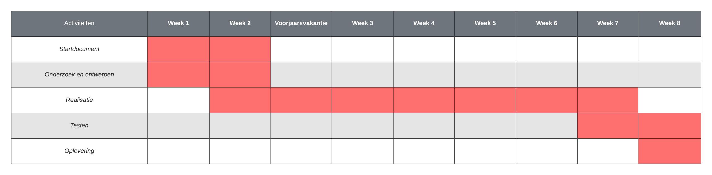

# Startdocument C# threading - Filemanager applicatie

Startdocument van **Monique Sabong**, **Rick Vinke** en **Thijs Janse**.

## Applicatie Beschrijving
Voor het vak Threading in C# gaan wij een filemanager applicatie maken. Voor deze applicatie hebben wij gekozen, omdat er veel threading mogelijkheden zijn. Met deze applicatie kan je gemakkelijk zien wat de snelheids verschil is tussen de threads. 

De applicatie zal ontwikkeld worden met **C# .NET versie 8** en **.NET Maui**.

## MosCow analyse

Must haves:
- De applicatie moet meerdere bestanden kunnen kopieeren. 
- De applicatie moet bestanden kunnen verplaatsen.
- De applicatie moet een speficiek bestand kunnen kopieeren.
- De applicatie moet tijdens het kopieeren het proces kunnen annuleren.
- Het moet mogelijk zijn om het aantal threads kunnen te bepalen.
- De applicatie heeft een interface.
- Filebrowser
- Toetscombinaties
- Twee schermen naast elkaar om gemakkelijk bestanden van de ene path naar de andere path te slepen. 
- De applicatie moet kunnen verifieren dat de bestanden goed zijn overgekomen.
- De gebruiker kan de overschrijf gedrag bepalen. Wanneer er bijvoorbeeld twee threads zijn die invloed hebben op dezelfde bestand kan je bepalen welke thread overschreden moet worden.
- De applicatie heeft een filter functie voor bestanden (regex)
- Bestanden kunnen sorteren.
- Verschillende weergaves bv lijst of raster. 
- Maken van symbolic links.
- Tabjes toevoegen
- Favorieten mappen lijst. Als je snel naar map E wilt, kan je die aan de lijst toevoegen. 

Should haves:
- Theming
- Synchronisatie functie. Hierbij worden twee mappen met elkaar vergeleken. Wanneer de eerste map bepaalde bestanden niet heeft, worden die gekopieerd. 
- De applicatie moet meerdere bestanden bij elkaar kunnen comprimeren.
- De applicatie moet de bij elkaar gecomprimeerde bestanden, decomprimeren.
- Front end heeft dark mode.

Could haves:
- Een tekst bestand kunnen uitlezen op inhoud en daarop filteren. Bijvoorbeeld meerdere tekst bestanden kunnen selecteren en zoeken op het woord 'test'.
- De applicatie kan op de achtergrond als een service gedraait worden. Hierbij kan een key aan gekoppeld worden om de applicatie aan te roepen voor bepaalde acties.
- Zoekdiepte bepalen in niveau's in de mappenstructuur. 

Won't have:

- Er komt geen mobiele versie. 

## Threading technieken

## Klassendiagram

## Planning

Om de voortgang van dit project te bewaken, is er een planning gemaakt. Deze planning bevat in grote lijnen hetgeen waarmee wij ons bezig zullen houden per week tot de deadline. Er kan natuurlijk afgeweken worden van deze planning, maar het is het doel om deze in grote lijnen te volgen.

Dit project is begonnen op maandag 5 februari 2024 en zal eindigen op vrijdag 4 april 2024.

## Literatuurlijst

- 
